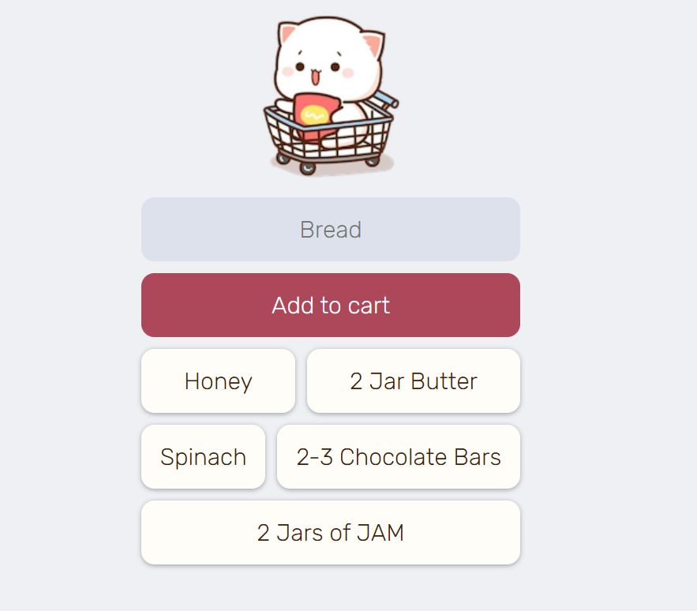

# AddToCart
A web app basically to keep a note of the things you have to buy from market, this is for learning purpose more precisely for learning Firebase and how to fetch data from real-time database.

## Working
* Write the name of the item to be bought.
* Add it to the cart.
* Double-click upon the item to delete when it's purchased.

## License
[MIT](https://choosealicense.com/licenses/mit/)